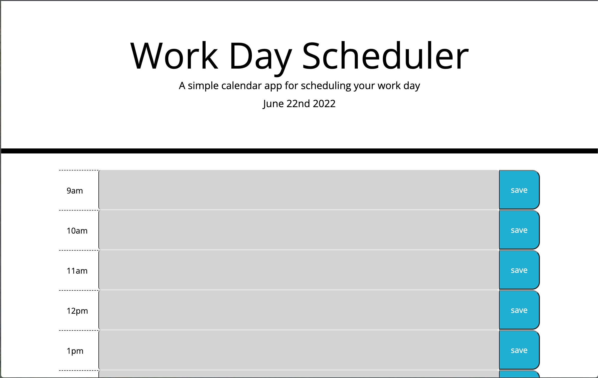

# Module 5 Challenge
# GWU Web Dev Bootcamp (Spring 2022)

This repo contains my (Matt Neal's) work on the challenge for the fifth module, which consists of a simple app for scheduling the work day.
The webpage can be viewed at https://nealmm.github.io/module5-challenge.

## Screenshot
